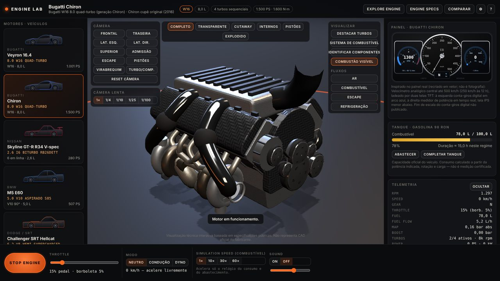
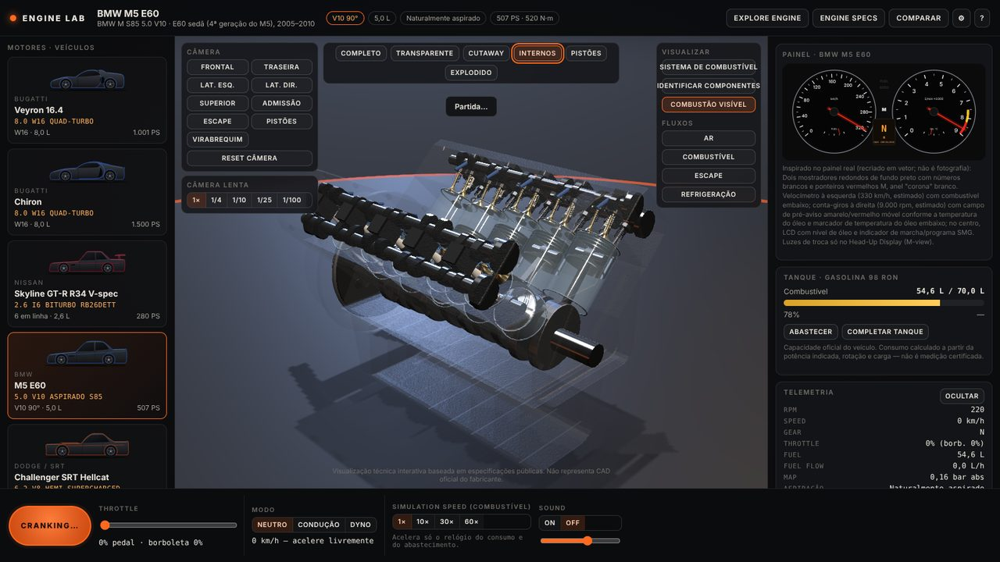
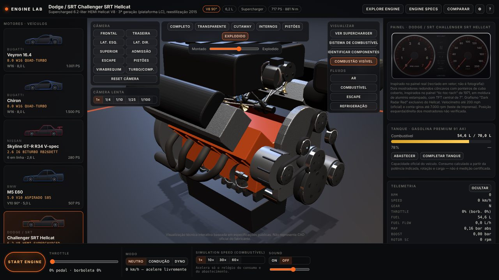
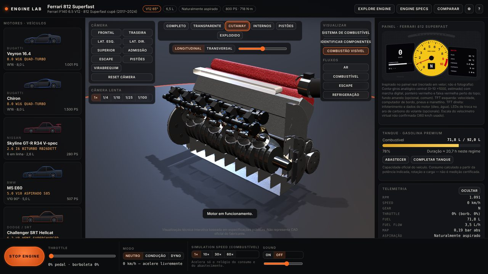
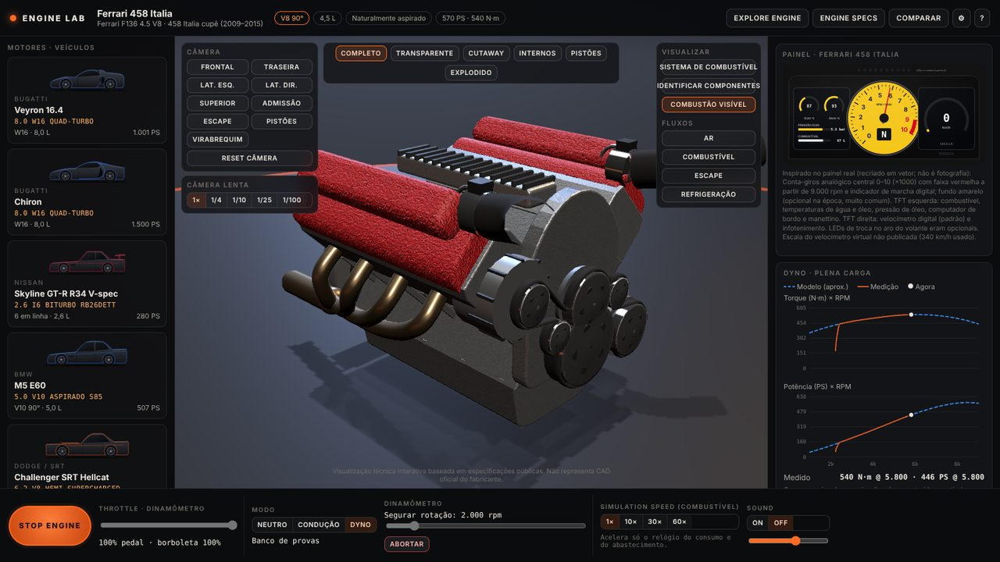
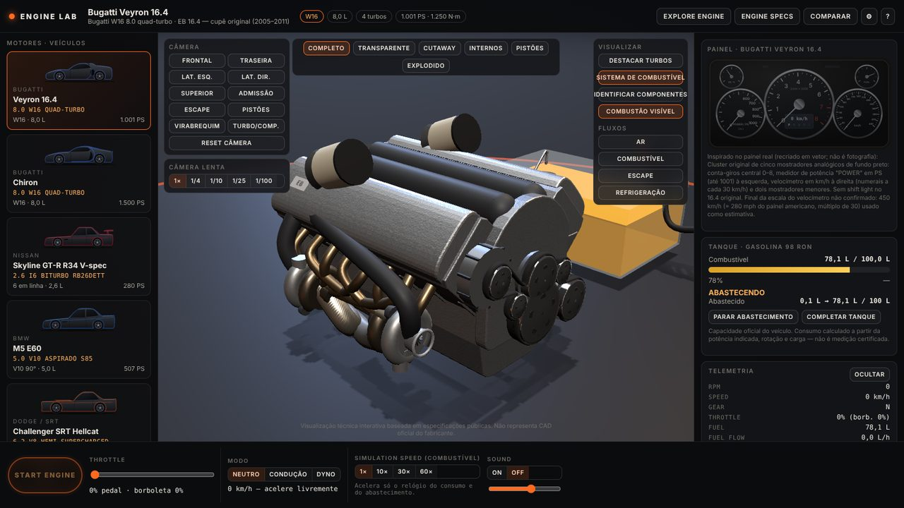
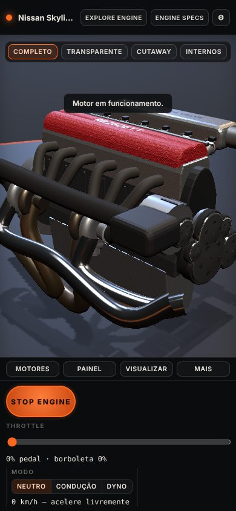

# ENGINE LAB — Interactive Performance Engine Simulator

Laboratório interativo de motores de alta performance no navegador: nove motores reais reconstruídos em 3D a partir de especificações públicas, com ciclo de quatro tempos animado por um único relógio físico, condução com câmbio e relações reais, dinamômetro, consumo e abastecimento, painéis inspirados nos carros e som procedural.



> Visualização técnica interativa baseada em especificações públicas. Não representa CAD oficial do fabricante.

## Capturas

| Internos (BMW S85 V10) | Explodido (Hellcat) |
|---|---|
|  |  |
| **Corte (Ferrari 812 V12)** | **Dinamômetro (Ferrari 458)** |
|  |  |
| **Abastecimento (Veyron)** | **Celular** |
|  |  |

## Os 9 motores

| Configuração | Motor | Arquitetura | Potência / torque | Observação |
|---|---|---|---|---|
| Bugatti Veyron 16.4 (2006) | W16 8.0 quad-turbo | W16 (2 × VR8 15°, 90°) | 1.001 PS · 1.250 N·m | 4 turbos em paralelo |
| Bugatti Chiron (2016) | W16 8.0 quad-turbo | W16 (2 × VR8 15°, 90°) | 1.500 PS · 1.600 N·m | turbos sequenciais (2 → 4) |
| Nissan Skyline GT-R R34 V-spec (1999) | RB26DETT | 6 em linha | 280 PS · 392 N·m | biturbo paralelo, 6 borboletas |
| BMW M5 E60 (2005) | S85B50 | V10 a 90° | 507 PS · 520 N·m | moentes comuns a 72°, ignição 90°/54° |
| Dodge Challenger SRT Hellcat (2015) | 6.2 HEMI supercharged | V8 a 90°, OHV | 717 PS · 881 N·m | compressor twin-screw 2,38 L |
| Chevrolet Performance ZZ632/1000 | big-block 10,4 L | V8 a 90°, OHV | 1.004 hp · 1.188 N·m | **Crate Engine / Performance Build** (não pertence a carro de série) |
| Ferrari 458 Italia (2010) | F136 FB | V8 a 90°, virabrequim plano | 570 CV · 540 N·m | 9.000 rpm |
| Ferrari 812 Superfast (2018) | F140 GA | V12 a 65° | 800 cv · 718 N·m | 8.900 rpm |
| Volkswagen W12 Syncro (estudo de 1997) | W12 5.6 | W12 (2 × VR6 15°, 72°) | 420 PS · 530 N·m | primeiro estudo W12, não o Phaeton/Bentley |

Cada valor tem situação (**oficial**, **fonte confiável**, **estimado**, **não confirmado**) e fontes no painel ENGINE SPECS. A pesquisa completa, com versões escolhidas, discrepâncias e links, está em [`docs/engine-research.md`](docs/engine-research.md).

## Funcionalidades

- **3D procedural por arquitetura**: bloco, cabeçotes, coletores, virabrequim, bielas, pistões, válvulas, comandos, velas, injetores; turbos e compressor só onde existem. Cada motor tem acabamento externo próprio (`src/engine/models/`).
- **Cinemática real**: biela-manivela, ordem de ignição e intervalos reais (ou ilustrativos e sinalizados quando não confirmados), válvulas sincronizadas, combustão visível opcional, câmera lenta até 1/100.
- **Modos de visualização**: completo, transparente (com opacidade), corte longitudinal/transversal, internos, pistões e explodido; destacar turbos / ver supercharger; identificar componentes; tour guiado (EXPLORE ENGINE).
- **Câmera**: órbita 360°, zoom, pan, reset e atalhos (frontal, traseira, laterais, superior, admissão, escape, pistões, virabrequim, turbo/compressor).
- **Simulação física**: curva de torque pelos pontos publicados, atrito e bombeamento, borboleta, marcha lenta com controle PI, corte em desaceleração, limitador, atraso de turbo e turbos sequenciais, compressor por relação de acionamento, temperaturas.
- **Condução**: rotação ligada à velocidade por relações reais, diferencial e pneu; câmbio automático/manual com N e R, aletas onde o carro real tem, velocidade alvo, limitador de velocidade.
- **Dinamômetro**: rotação fixa ou varredura em plena carga com gráficos de torque × rpm e potência × rpm ("Curva aproximada para visualização").
- **Painéis**: nove painéis em SVG inspirados nos clusters reais (nunca fotos), com escalas, faixa vermelha, limitador, combustível, temperaturas e pressão de turbo/compressor.
- **Combustível**: tanque real de cada carro, consumo por rotação, carga e potência, aceleração do relógio de consumo (1×/10×/30×/60×), pane seca ("SEM COMBUSTÍVEL"), abastecimento animado (bico, mangueira, fluxo) com parar e completar tanque, sistema de combustível em 3D.
- **Fluxos**: ar, combustível, escape e arrefecimento.
- **Comparar** dois motores lado a lado.
- **Som procedural** (sem amostras gravadas): eventos de combustão do próprio virabrequim, um escapamento por bancada, assobio de turbo, blow-off e compressor; liga/desliga e volume.
- **Gráficos** LOW / MEDIUM / HIGH / ULTRA, carregamento por motor, tela de carregamento com etapas reais, layout responsivo com gavetas no celular, acessibilidade (ARIA, teclado, "reduzir movimento").

## Instalação e execução

Requer Node.js 20.19 ou mais recente (exigência do Vite 7).

```bash
npm install
npm run dev        # servidor de desenvolvimento (http://localhost:5173)
npm run build      # typecheck + build de produção em dist/
npm run preview    # serve o build
npm test           # testes (Vitest)
npm run docs:research   # regenera docs/engine-research.md a partir dos dados
```

O build é estático (`base: './'`), pronto para GitHub Pages; o workflow `.github/workflows/deploy.yml` testa, compila e publica a cada push em `main`.

Parâmetros de URL opcionais: `?engine=<id>&view=<modo>&q=<low|medium|high|ultra>&intro=0&sound=0&cam=<preset>`.

## Controles

| Tecla | Ação |
|---|---|
| `S` | ligar / desligar o motor |
| `↑` / `↓` | acelerador ±5% |
| `E` / `Q` | subir / reduzir marcha |
| `1`–`6` | completo, transparente, corte, internos, pistões, explodido |
| `C` | reset da câmera |

Mouse/toque: arrastar gira, roda/pinça aproxima, botão direito/dois dedos move.

## Estrutura

```
src/
  data/            dados dos motores (um arquivo por configuração) + helpers
  types/           modelo de dados (EngineDefinition, SpecRow, status…)
  simulation/      física, cinemática, layout do virabrequim, câmbio, combustível (+ testes)
  engine/          renderizador 3D: peças, materiais, modelos por motor, câmera, fluxos
  dashboard/       painéis SVG por carro e utilitários de instrumentos
  audio/           síntese procedural (AudioWorklet) e configuração por motor
  components/      interface (seletor, controles, painéis, modais, tour)
  state/           stores Zustand (app e simulação)
  hooks/           atalhos de teclado e parâmetros de URL
docs/              pesquisa, simulação, guia de modelos, capturas
scripts/           gerador da documentação de pesquisa
```

## Como adicionar um motor

1. Crie `src/data/engines/<carro>.ts` com um `EngineDefinition`: especificações verificadas (`specs` com situação e fontes), parâmetros de simulação e a lista `estimates` do que não foi publicado.
2. Inclua o id em `EngineId` (`src/types/engine.ts`) e registre o motor em `src/data/engines.ts`.
3. Crie o exterior em `src/engine/models/<carro>.tsx` e registre-o em `src/engine/models/index.ts` (guia: [`docs/MODEL_AUTHORING.md`](docs/MODEL_AUTHORING.md)). Os internos são gerados automaticamente.
4. Crie o painel em `src/dashboard/dashboards/` e registre o estilo em `DashboardHost.tsx` e em `DashboardStyle`.
5. Escolha um `SoundProfile` (ou crie um em `src/audio/soundProfiles.ts`).
6. Rode `npm test` (os testes de integridade checam cilindrada, conversões de potência, rotações, relações × velocidade máxima, fontes, marcha lenta e limitador simulados) e `npm run docs:research`.

## Limitações

- Os modelos 3D são reconstruções procedurais, não CAD dos fabricantes; proporções e acabamentos são aproximados.
- Curvas de torque e potência são interpoladas a partir dos pontos publicados (pico de torque, pico de potência), não medições.
- Consumo é calculado por consumo específico × potência indicada × enriquecimento — não é medição homologada.
- Alguns dados nunca foram publicados e aparecem como estimativa: marchas lentas, relações do 812 e do W12, massa do 458, pneus/tanque/velocidade do W12, ordens de ignição do Veyron, Chiron, 458, 812 e W12 (animação ilustrativa).
- O painel do W12 é genérico (não há referência do painel do estudo de 1997); o do ZZ632 é um painel de bancada não oficial.
- O som é sintetizado: busca o caráter de cada arquitetura (ordem de ignição, bancadas, turbo, compressor), não uma gravação fiel.

## Fontes

Fontes oficiais primeiro (Bugatti Newsroom, Nissan Heritage Collection, BMW PressClub e manual técnico ST505, Stellantis/FCA Media, GM/Chevrolet Performance, ferrari.com e kits de imprensa Ferrari, Italdesign/Volkswagen of America), depois fontes reconhecidas (Car and Driver, auto motor und sport, evo, catálogos japoneses). Lista completa, por motor, em [`docs/engine-research.md`](docs/engine-research.md).

## Créditos e licenças

- Código: licença MIT ([`LICENSE`](LICENSE)).
- Bibliotecas: React, Three.js, @react-three/fiber, @react-three/drei, @react-three/postprocessing, Zustand, Vite, Vitest — ver [`ATTRIBUTIONS.md`](ATTRIBUTIONS.md).
- Nenhum modelo, textura ou som de jogos ou lojas pagas foi usado: geometria, texturas, silhuetas dos carros, painéis e áudio são gerados pelo próprio projeto.
- Nomes e marcas (Bugatti, Nissan, BMW, Dodge, Chevrolet, Ferrari, Volkswagen) pertencem aos seus donos e aparecem apenas para identificar os motores; o projeto não tem vínculo com os fabricantes.
